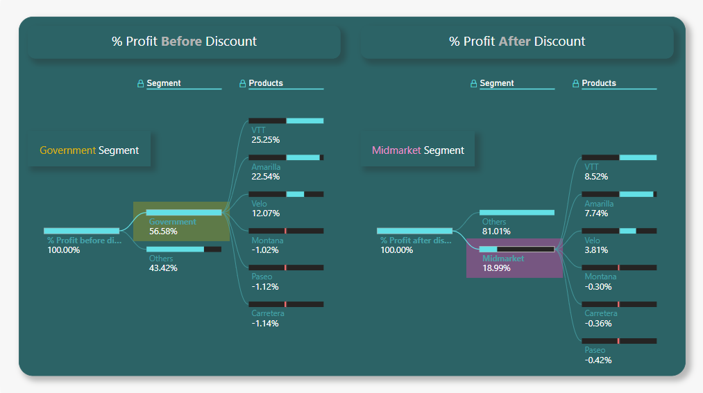
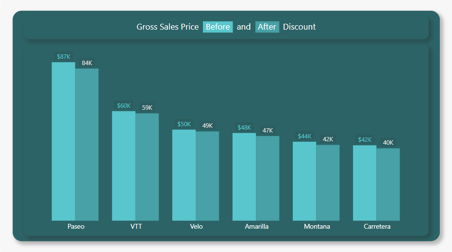
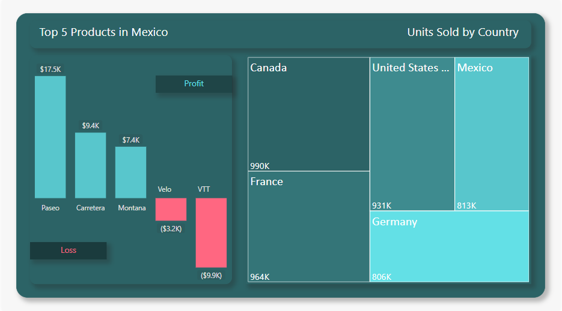
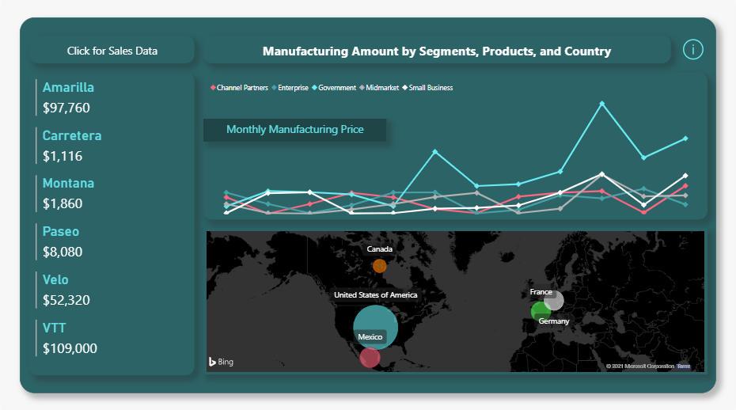
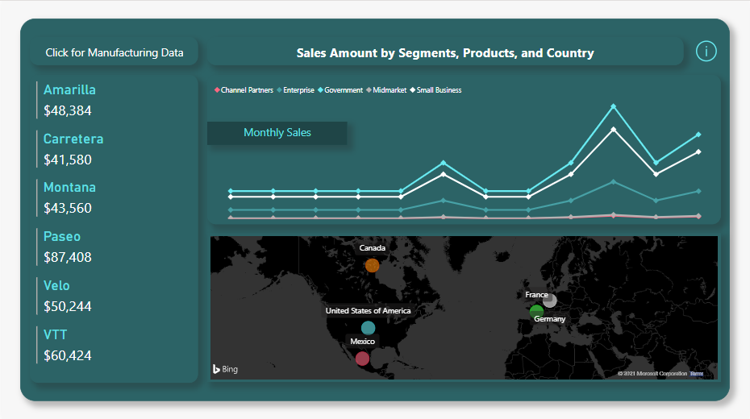

# Adanced Sales Report using Power BI

Created an extended Sales report using the data (Data2.xslx) available in this Repo

## Report consists of the below findings:

#### Page 1:
- profit after discount in % for Government segment
- profit before discount in % for Midmarket segment

#### Page 2:
- product list with Gross sales amount after and before discount

#### Page 3:
- Profit and Loss of top 5 products sold in Mexico
- Units Sold by Country

#### Page 4:
- Interactive Page with Sales and Manufacturing Data using the top left button on the page

